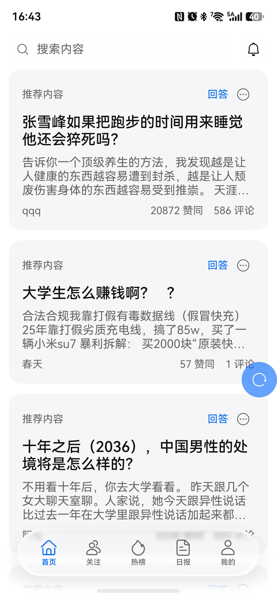
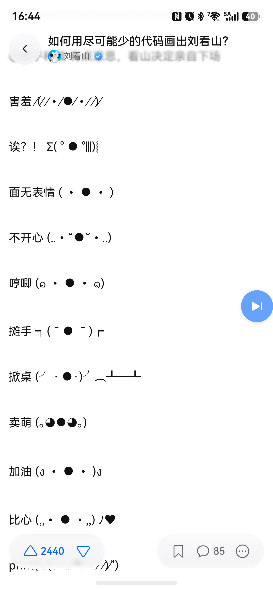

# Zhihu++鸿蒙版：注重隐私、互联网个人权利和无广告的知乎客户端

## HarmonyOS 原生构建

本仓库是 Zhihu++ 的 **鸿蒙（HarmonyOS）原生移植版**：用 ArkTS/ArkUI 重写，**接入鸿蒙特色沉浸光感**，目标是在鸿蒙设备上提供与安卓 Lite 版一致的隐私增强、去广告、内容过滤体验。

> [!IMPORTANT]
> 本项目不是知乎官方产品，与知乎及其关联公司不存在隶属、授权或背书关系。项目依赖非公开接口，知乎服务端的变化可能随时导致部分功能失效。

### 特别感谢源项目

感谢源项目开发者 [zly2006](https://github.com/zly2006) 以及所有上游贡献者，用优美的代码完成了高质量的Android构建，使得本项目有出现的可能。

本项目APP名称及图标经 zly2006 **授权使用**。

[点击查看源项目](https://github.com/zly2006/zhihu-plus-plus)

本项目问题请前往本仓库issue进行反馈。

## 应用截图

| 首页 | 关注 | 日报 | 个人主页 | 文章 |
| --- | --- | --- | --- | --- |
|  |  |  |  |  |

### 已实现功能

> 鸿蒙版仍在开发中，功能覆盖以各阶段验收文档为准；与安卓版的差异见下方[尚未移植的功能](#尚未移植的功能)。

- 登录与账号
    - 支持手机验证码登录
    - 支持扫码登录（本机出示二维码，用已登录知乎的设备扫码）
    - 支持网页登录
    - 支持手动设置 Cookie 登录（设置页开发者选项）
- 信息流与推荐
    - 首页推荐支持 Web / 安卓 / 本地 / 混合模式
    - 支持切换 **登录状态 / 非登录状态** 下的推荐，防止信息茧房
    - 支持关注页（推荐/动态双子页）、热榜、知乎日报、搜索（含热搜、历史、排序/类型/时间筛选）
    - 支持智能内容过滤、质量过滤、反向屏蔽、过滤统计与屏蔽记录
    - **支持屏蔽知乎盐选付费内容**
- 内容浏览
    - 阅读回答
    - 阅读文章
    - 浏览问题详情页（排序、关注、日志、分享、评论）
    - 浏览想法（Pin）详情页（评论、分享、话题）
    - 浏览收藏夹及收藏夹内容
    - 历史记录（在线历史 + 本地历史，支持删除）
    - 展示知乎官方认证徽章
    - 应用内播放知乎视频
- 阅读
    - 朗读内容（听文章 / 听回答，支持下载音色）
    - 回答页长按保存图片 **无水印**
    - 回答切换手势（上下/左右切换）与可拖动的“下一个回答”按钮
    - 沉浸式阅读，可隐藏回答区干扰元素
    - 内容划线高亮（查看他人划线，支持点赞、评论与复制）
    - 图片查看器支持动图（GIF）与捏合缩放
    - 数学公式渲染（LaTeX）
    - 支持调节正文段间距
    - 可拖动滚动条、上划/下划自动隐藏/显示操作按钮
- 内容创作
    - 支持写回答、编辑已有回答、保存草稿和发布回答
    - 写回答支持插入图片（上传知乎图床）
- 社区互动
    - 支持查看个人主页、关注用户；支持拉黑用户（端侧黑名单）与屏蔽 TA 的推荐
    - 评论区（含子评论、回复、点赞、按时间排序）
    - 通知（支持分类、红点设置、全部标记已读、自动标记已读与通知筛选）
    - 表情包（评论与通知中渲染知乎小表情）
- 屏蔽系统
    - 屏蔽词（支持正则表达式）
    - 屏蔽用户（信息流过滤，回答/想法详情页与主页入口）
    - 屏蔽话题（首页推荐、频道/热榜、搜索、回答列表等场景）
    - **导出屏蔽词** & **导入屏蔽词**（支持跨设备迁移）
    - 屏蔽历史记录
- 其他
    - ArkTS/ArkUI 原生实现：entry 主模块 + core / data / reader 共享库四模块架构
    - 支持 zse96 v2 签名算法（可以调用 99% 的网页端 API）
    - 支持模拟安卓端 API 调用
    - 支持 Deep Link 跳转（zhihu:// 与网页链接直达问题/回答/文章/用户/视频/想法等）
    - 主界面支持横滑切换标签页
    - 支持自定义初始页面
    - 双击操作快速 **点赞** 或 **打开评论区**（另可选切换沉浸式阅读）
    - 点击底部导航栏回到顶部/刷新

### 尚未移植的功能

> 以下功能存在于安卓上游，鸿蒙版尚未实现：

- AI 总结内容
- 导出内容（PDF / 图片 / Markdown / HTML）与导出整个收藏夹
- NLP 屏蔽词（基于 LLM embedding 和向量相似度匹配）
- 防沉迷提醒
- 回答赞同者列表，以及“关注的人赞同了此回答”展示
- 记名标记疑似 AIGC 内容（含有效标记与投票人查看）
- 在用户主页内搜索 TA 的创作；个人主页的关注/订阅者列表板块
- 想法（Pin）的点赞与投票
- 写回答的 Markdown 编辑与预览
- 图片查看器多图左右滑动切换
- 回答/文章正文中的小表情渲染
- 剪贴板链接识别跳转
- 通用二维码扫码结果展示和复制
- 经典表情 `[惊喜]` 

### 下载

可在本项目[release页面](https://github.com/zhuoyi233/zhihu-plus-plus-HMOS/releases)获取未签名HAP包。

可使用[小白调试助手](https://github.com/likuai2010/auto-installer/releases)或[HoKit](https://github.com/yabi-zzh/HoKit/releases)自行签名并安装。

### 开源协议

本项目遵循 AGPL-3.0 开源协议
