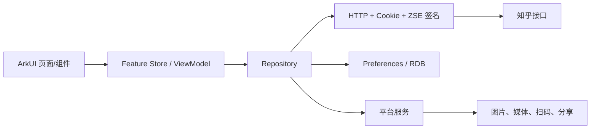
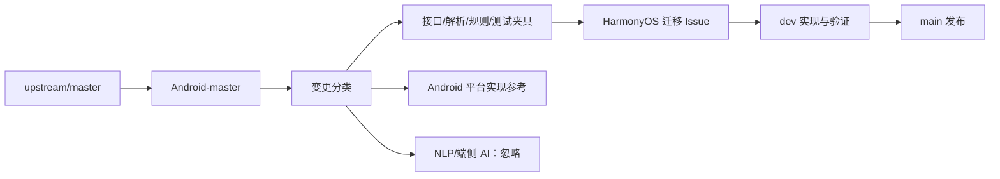

# Zhihu++ HarmonyOS 迁移方案

> 状态：规划稿<br>
> 制定日期：2026-07-20<br>
> 迁移基线：Android Lite 版本<br>
> 开发工具：DevEco Studio 6.1.1 Release<br>
> HarmonyOS SDK：26.0.0（API 26）<br>
> 目标兼容版本：HarmonyOS 26.0.0（API 26）<br>
> 目标分支：`dev`（开发）、`main`（发布）<br>
> Android 上游镜像：`Android-master`

## 1. 迁移结论

本项目采用“ArkTS/ArkUI 原生重写、以 Android Lite 行为为规格、分阶段替换”的路线，不尝试把当前 Kotlin/Compose 代码直接运行在 HarmonyOS 上。

迁移原则：

1. Android Lite 版本充当行为规格和兼容性样本。
2. 将接口协议、解析规则、过滤逻辑、推荐规则和测试用例迁移到 ArkTS。
3. UI、生命周期、存储、后台任务和媒体能力按 HarmonyOS 原生方式重新设计。
4. HarmonyOS 的 `main`、`dev` 不长期携带 Android 工程；Android 历史代码保留在 `Android-master`。
5. 首个可用版本优先保证登录、浏览、阅读和过滤，不追求一次性完整移植所有高级能力。

## 2. 目标平台与官方技术基线

- 开发工具固定为 DevEco Studio 6.1.1 Release。
- HarmonyOS 开发、运行与验证主基线固定为 26.0.0（API 26）。工程的 `targetSdkVersion` 与 `compatibleSdkVersion` 均使用 API 26，编译环境使用 DevEco Studio 的 API 26 SDK。
- 不再维护 API 24 或更低版本的兼容路径；设备验收只在 `ZhihuPlus_API26` 模拟器与后续 API 26 设备上进行。
- 使用 Stage 模型。
- 第一阶段支持 Phone，随后适配 Tablet、折叠屏和自由窗口。
- 开发语言为 ArkTS，UI 使用 ArkUI 声明式范式。
- 新代码优先使用 ArkUI 状态管理 V2。
- 耗时计算使用 TaskPool，只有确实需要常驻并发实例时才使用 Worker。

官方依据：

- [ArkTS 概述](https://developer.huawei.com/consumer/cn/doc/harmonyos-guides/arkts-overview)
- [ArkTS 官方介绍](https://developer.huawei.com/consumer/cn/arkts/)
- [ArkTS 开发入门与并发能力](https://developer.huawei.com/consumer/cn/arkts/devstart/)
- [Stage 模型概述](https://developer.huawei.com/consumer/cn/arkui/arkui-stage/)
- [Stage 应用包结构](https://developer.huawei.com/consumer/cn/doc/harmonyos-guides/application-package-structure-stage)
- [ArkUI 状态管理 V2 迁移说明](https://developer.huawei.com/consumer/cn/doc/harmonyos-guides/arkts-v1-v2-migration-inner-class)
- [HarmonyOS 6.1.1（API 24）版本说明](https://developer.huawei.com/consumer/cn/doc/harmonyos-releases/overview-611)
- [HarmonyOS SDK 文档中心](https://developer.huawei.com/consumer/cn/doc/)

从 2026-08-10 起，版本矩阵收敛为 API 24 单一基线：开发、编译、目标行为、最低兼容和设备回归均只考虑 API 24。DevEco Studio 6.1.1 官方模板不单独写 `compileSdkVersion`；实际编译 SDK 由构建环境中的 API 24 SDK 决定。此前 API 20 的实验结果保留为历史记录，但不再约束新实现，也不再要求 API 20 降级路径。

从 2026-08-25 起，P4 将版本矩阵升级为 API 26 单一基线：`targetSdkVersion`、`compatibleSdkVersion`、构建和设备验收统一为 API 26。此前 API 24 的阶段记录保留为历史证据，不再构成后续 P4 的实现或验收约束。

## 3. AI 能力边界

### 3.1 明确排除

以下内容不进入 HarmonyOS 项目：

- `sentence_embeddings`
- `rs-hf-tokenizer`
- HanLP
- `NLPService`
- `SentenceEmbeddingManager`
- 语义相似度过滤和语义关键词匹配
- 本地文本向量化
- 模型下载和模型管理
- 向量数据库
- MindSpore、NNRT、NPU 推理
- 任何端侧大模型能力
- 与上述能力对应的设置项、页面、模型资源和 Native 库

核心迁移基线暂不实现“知答 AI 总结”。它属于服务端推理而非端侧 AI，但不是 Lite 核心阅读能力，后续只有在用户明确确认、隐私说明完整且接口稳定时才单独立项。

### 3.2 可以保留

以下功能不属于端侧 AI：

- 关键词、正则、用户和话题屏蔽
- 基于历史和显式权重的规则型本地推荐
- 阅读行为记录和确定性排序
- AIGC 社区标记、投票和人数展示
- 普通内容质量规则
- 系统文本转语音

AIGC 标记涉及上传当前内容，应继续保持默认关闭并明确告知。系统 TTS 作为后置能力评估，不捆绑进首个 MVP。参考：[Core Speech Kit](https://developer.huawei.com/consumer/cn/sdk/core-speech-kit/)。

## 4. 目标工程结构

首版控制模块数量，避免一开始按每个页面创建 HAR：

```text
zhihu-plus-plus-HMOS/
├─ AppScope/
├─ entry/                 # HAP、UIAbility、页面与功能
│  └─ src/main/ets/
│     ├─ pages/
│     ├─ features/
│     │  ├─ home/
│     │  ├─ content/
│     │  ├─ comment/
│     │  ├─ people/
│     │  ├─ search/
│     │  ├─ account/
│     │  └─ settings/
│     └─ platform/
├─ core/                  # HAR：模型、导航契约、过滤规则、公共类型
├─ data/                  # HAR：HTTP、Cookie、签名、RDB、Repository
├─ reader/                # HAR：HTML 解析、正文 AST、公式、图片、导出
├─ contracts/
│  ├─ fixtures/           # Android 提取的脱敏接口响应
│  └─ golden/             # 签名、解析、过滤、推荐黄金结果
└─ build-profile.json5
```

首期只建立 `entry + core + data + reader`。功能代码先按目录划分；只有出现独立复用、构建隔离或多人并行需求时，才继续拆 HAR。

### 4.1 数据流



采用单向状态流：

- 页面只表达状态和用户事件。
- Store 持有加载、分页、错误、草稿、滚动恢复等状态。
- Repository 负责数据来源选择和缓存。
- 平台服务接口保持窄小，例如分享、图片保存、TTS，不建立承载大量无关能力的“大 Environment”。
- `AppStorageV2` 只保存真正的应用级瞬时 UI 状态；设置进入 Preferences，持久业务数据进入 RDB。

## 5. Android 到 HarmonyOS 能力映射

| Android 当前能力 | HarmonyOS 方案 | 迁移策略 |
| --- | --- | --- |
| Activity | Stage UIAbility | 首期一个主 UIAbility |
| Jetpack Compose | ArkUI | 原生重写组件 |
| Navigation Compose | `Navigation` + `NavPathStack` | 保留强类型目标和参数编码，[Navigation 指南](https://developer.huawei.com/consumer/cn/doc/harmonyos-guides/arkts-navigation-navigation) |
| Ktor | Network Kit HTTP API | 建立统一请求客户端，[HTTP 指南](https://developer.huawei.com/consumer/cn/doc/harmonyos-guides/http-request) |
| Room | ArkData RDB | 显式 schema、version 和 migration，[RDB 指南](https://developer.huawei.com/consumer/cn/doc/harmonyos-guides/data-persistence-by-rdb-store) |
| SharedPreferences | Preferences | 只存轻量配置，[Preferences 指南](https://developer.huawei.com/consumer/cn/doc/harmonyos-guides/data-persistence-by-preferences) |
| 明文 `account.json` | 加密会话文件 + Asset Store 数据密钥 | Cookie 和令牌不得明文保存，[Asset Store](https://developer.huawei.com/consumer/cn/doc/harmonyos-guides/asset-store-kit-overview) |
| Coil | ArkUI Image/Image Kit + 缓存层 | 统一内存、磁盘和失败重试策略 |
| Compose Markdown | ArkUI 原生正文 AST | HarmonyOS 正文主路径 |
| WebView | ArkWeb | 仅登录、风控和不支持的嵌入内容，[ArkWeb 加载指南](https://developer.huawei.com/consumer/cn/doc/harmonyos-guides/web-page-loading-with-web-components) |
| ExoPlayer | Media Kit AVPlayer | 视频、音频播放 |
| ZXing/扫码 Activity | Scan Kit | 登录辅助和二维码识别，[Scan Kit](https://developer.huawei.com/consumer/cn/sdk/scan-kit) |
| Android Share Intent | Share Kit | 文本、图片和文件分享，[Share Kit](https://developer.huawei.com/consumer/cn/doc/harmonyos-guides/system-share) |
| WorkManager | Background Tasks Kit | 仅合规的短时、延迟或长时任务 |
| JUnit/Compose UI Test | Test Kit/ArkXTest | 单元、组件和端到端测试，[测试指南](https://developer.huawei.com/consumer/cn/doc/harmonyos-guides/arkxtest-guidelines) |

## 6. 关键子系统设计

### 6.1 网络与账号

这是最高风险模块，应最先验证。

统一 HTTP 客户端需要支持：

- CookieJar 与会话持久化
- Web API 和移动端 API 两套请求头配置
- ZSE96 v2 签名
- 超时、取消、分页和重试
- 401/会话失效处理
- SSE，仅在未来确实需要时加入
- 日志脱敏
- 测试环境响应注入

ZSE 签名优先迁移为纯 ArkTS，并用 Android 当前测试向量逐字节验证。只有纯 ArkTS 无法满足兼容性或性能时，才考虑通过 Node-API/NDK 携带最小原生实现，不能直接搬运整个 Android JNI/Rust 体系。

登录实现顺序：

1. 游客模式。
2. 手动 Cookie 导入。
3. 二维码登录。
4. Web 登录/风控页面兜底。
5. 手机验证码登录最后评估。

二维码或 Web 登录成功后都进入同一 Session Repository。加密密钥放入 Asset Store，Cookie 密文放应用沙箱；日志、崩溃信息和导出文件不得包含 Cookie。

二维码登录分为两个独立方向：本机扫描电脑端登录码使用 Scan Kit 默认界面；本机显示登录码供其他设备扫描则迁移二维码创建、`scan_info` 轮询、风控和 Cookie 同步协议。扫码成功只表示得到码值，不能直接计为登录成功。P0 验证记录见 [`scan-kit-validation.md`](p0/scan-kit-validation.md)。

### 6.2 数据模型与解析

继续保留当前数据边界：

- `WireDto` 描述外部 `snake_case` JSON。
- `DomainModel` 使用 `camelCase` 业务类型。
- 映射集中处理，页面禁止直接操作原始 JSON。
- 将 Android 测试中典型的 feed、文章、评论、通知和用户响应脱敏后固化为 fixtures。
- Android 和 HarmonyOS 对同一 fixture 输出规范化 JSON，结果必须一致。

优先迁移顺序：

1. 内容 ID、URL 和类型解析。
2. Feed 与分页。
3. 问题、回答、文章和想法。
4. 用户和搜索。
5. 评论。
6. 收藏、通知和历史。
7. 写作与上传。

### 6.3 导航和状态恢复

采用一个根 `Navigation/NavPathStack`，定义强类型目的地：

- Home
- Question
- Answer
- Article
- Pin
- People
- Comment
- Search
- Collection
- Notification
- Settings

必须验证：

- 从评论进入用户页后返回，评论弹层和滚动位置恢复。
- 从列表进入正文后返回，列表位置不丢失。
- 编辑器关闭再打开，按编辑目标恢复草稿。
- 同一导航目标不重复入栈。
- `https://www.zhihu.com/...` 和 `zhihu://...` 深链统一解析。
- 进程重建后恢复必要路径，但不恢复已失效的瞬时弹层。

P0 最终结论：API 24 已通过主要知乎 URL、`link.zhihu.com` 和 `zhihu://` 的纯 ArkTS 映射，以及隐式 Want 冷启动和 `onNewWant()` 热启动验证。19 位内容 ID 必须保持字符串。由于项目不控制知乎域名，HTTPS skill 不启用域名验证，不能宣称为无选择器的 App Linking；正式无选择器入口应使用项目自有域名。详见 `docs/p0/deep-link-validation.md`。

### 6.4 正文渲染

正文不能把 ArkWeb 当成永久主方案。

```text
知乎 HTML
  → 清洗与结构保真
  → Block/Inline AST
  → ArkUI 原生组件
  → 文本、链接、图片、代码、引用、列表、公式、段评
```

实现原则：

- 块级内容通过懒加载列表渲染。
- 行内内容使用 Text/Span 或自定义 Span。
- 图片支持预览、保存、分享和 GIF。
- 脚注、链接、图片、公式的原始格式优先于段评高亮。
- 长文章需要增量解析和分块渲染，禁止在 UI 主线程一次性处理全部 HTML。
- HTML 解析、过滤和排序放入 TaskPool。

公式是 P0 必须验证的独立风险项，候选顺序：

1. 公式转 SVG/PixelMap，原生显示。
2. 合格的 HarmonyOS 数学排版库。
3. 仅公式节点使用受限 ArkWeb。
4. 不接受整篇正文退回 Web。

P0 阶段结论（2026-08-10）：API 24 虚拟机证明远程 SVG URL 直接交给 `Image`/`ImageSpan` 会失败；最终路线由 `NetworkKit` 下载严格白名单内的公式 SVG，校验状态码、类型、大小与 SVG 根节点，禁止重定向，再把知乎 SVG 的 `ex` 尺寸和 `currentColor` 规范化为 ImageKit 可解码形式。`ImageSource` 解码后的 PixelMap 分别交给原生 `Image` 和 `ImageSpan`，网络或解码失败时仅对应节点降级为 TeX。真实长文的 11 个块公式和 63 个行内公式已在 API 24 虚拟机全部解码并连续滚动到文末，无降级、无崩溃。`RichText` 因底层复用 Web、列表内存与维护状态限制退出主路线，整篇正文保持 ArkUI 原生渲染；`P0-MATH-01` 已关闭。API 20 失败结果只作为历史证据。详见 `docs/p0/reader-validation.md`。

普通网络图片与 GIF 已在 API 24 虚拟机通过：正文 AST 选择知乎懒加载真实地址，ArkUI `Image` 负责加载和 GIF 逐帧解码，并提供失败重试与原生全屏预览。P0 像素差验证确认 GIF 不只是静态首帧；缩放、保存、分享和统一缓存留到 P1/P2。详见 `docs/p0/image-validation.md`。

### 6.5 本地存储

分成三类：

- Preferences：主题、开关和页面偏好。
- RDB：过滤记录、已读记录、历史、推荐行为、爬取任务和草稿元数据。
- 应用文件：缓存、导出文件和较大正文快照。

首期需要迁移的 RDB 领域：

- 屏蔽关键词、用户和话题
- 已屏蔽内容记录
- Feed 屏蔽记录
- 内容打开/阅读记录
- 本地推荐 Feed
- 用户显式行为
- 推荐爬取任务与结果

新平台首版不兼容 Android Room 数据库文件。跨平台迁移先支持稳定的 JSON 导入导出格式；以后确有需求再做 Android 数据包导入工具。

P0 最终结论：API 24 已通过 RDB v1 建库、v1 → v2 升级、故障迁移原子回滚和关闭重开验证。生产 schema 必须使用连续、显式且事务化的 migration，未知版本直接拒绝，禁止以删除重建掩盖升级失败。详见 `docs/p0/database-validation.md`。

### 6.6 本地推荐

保留确定性规则推荐，但不引入模型：

- 显式喜欢、不感兴趣和屏蔽行为
- 关注用户/话题信号
- 阅读完成度或打开记录
- 时间衰减
- 规则权重与解释文本
- 候选去重和已读过滤

解析和批量评分可使用 TaskPool。首期只在前台或用户主动触发时执行；Stage 模型严格治理后台常驻，因此不能照搬 Android 的常驻调度逻辑。

P0 阶段结论（2026-08-10）：TaskPool 只解决并发计算，不提供后台存活保证。主动刷新和规则推荐只在前台运行；短时任务只允许收尾已经开始的有限操作；非紧急维护可交给系统延迟任务；首版禁止后台常驻或周期性抓取知乎 Feed。P0 未申请 `KEEP_BACKGROUND_RUNNING`，未来只有音频播放或用户可感知的数据传输等合规场景才单独接入长时任务。API 24 虚拟机已验证短时任务配额读取/释放和延迟任务登记/清理，详见 [`background-task-validation.md`](p0/background-task-validation.md)。

### 6.7 媒体和系统能力

- 图片：网络加载、预览、缩放、保存和分享。
- 视频：AVPlayer；首期前台播放，画中画和后台播放后置。
- 音频/TTS：后置；后台播放需遵守 AVSession 和长时任务要求。参考：[音频播放概述](https://developer.huawei.com/consumer/cn/doc/harmonyos-guides/audio-playback-overview)。
- 扫码：Scan Kit。
- 分享：Share Kit 和 UDMF 数据类型。
- 外部链接：通过 Want 拉起浏览器。
- 文件导出：系统 Picker 选择保存位置。
- 更新：删除 Android APK 自更新逻辑，改为应用市场版本更新策略。
- 通知：首期只实现应用内通知列表，不接 Push Kit。

## 7. 分阶段实施计划

### P0：技术验证与规格冻结，1–2 周

交付：

- 使用 DevEco Studio 6.1.1 Release 和 HarmonyOS 6.1.1（API 24）建立工程，验证 API 24 编译环境和 `targetSdkVersion` 配置。
- 将 `targetSdkVersion` 和 `compatibleSdkVersion` 均配置为 API 24，建立 API 24 单一设备测试基线。
- 盘点 API 24 系统能力、权限和使用场景限制，不再实现 API 20 降级路径。
- 创建最小 Stage 应用并完成签名。
- 验证知乎公开接口请求。
- 验证 Cookie 保存和恢复。
- ZSE 签名黄金向量通过。
- 一份真实长文章完成原生渲染。
- 验证公式、GIF 和网络图片。
- 验证 RDB 建库和升级。
- 验证深链和二维码。
- 实验后台任务限制。
- 整理 Lite 功能矩阵和禁止迁移的 AI 文件清单。

退出条件：签名、登录、长正文、公式四个高风险点都有可运行原型。任何一个失败都先调整架构，不进入全面页面开发。

状态（2026-08-11）：P0 的 14 个门禁全部通过，签名、真实 Cookie 登录、原生长正文和原生公式路线均已在 API 24 DevEco 虚拟机闭环；可以进入 P1。详细证据与性能烟测见 [`docs/p0/p0-summary.md`](p0/p0-summary.md)。

### P1：基础设施，2–4 周

交付：

- `entry/core/data/reader` 工程结构。
- 主题、深浅色、字体缩放和窗口安全区。
- Navigation 与强类型目的地。
- HTTP、Cookie、签名和错误模型。
- Preferences、RDB 和加密会话。
- 基础 DomainModel 和 fixtures。
- 日志、构建配置、测试框架和 CI。
- 首个 AppStartup 初始化图，非必要初始化不得阻塞首页。参考：[AppStartup](https://developer.huawei.com/consumer/cn/doc/harmonyos-guides-V5/app-startup-V5)。

状态（2026-08-11）：P1 本地实现与 API 24 验证已收口。工程拆分为 `entry/core/data/reader`，主题与 Preferences、强类型 Navigation/冷热深链、统一 HTTP/Cookie/ZSE 安全边界、生产 RDB 生命周期、DomainModel 与真实 rawfile fixture、AppStartup、日志和自托管 CI 门禁均已落地。P1 基线的四模块构建与 Hypium `89/89` 已通过；进入 P2 后 fixture catalog 增加 mixed Feed 样本至 8 份，统一门禁升级为 Hypium `128/128`。远端 CI 仍需要仓库侧启用 `ENABLE_HARMONYOS_API24_CI` 并提供匹配的 self-hosted runner，属于外部环境配置，不阻塞 P2 开发。

### P2：只读 MVP，4–6 周

范围：

- 游客模式
- Cookie/二维码登录
- 首页 Feed
- 关注、热榜和日报
- 搜索
- 问题、回答、文章和想法
- 用户主页
- 原生正文
- 图片预览
- 关键词、用户和话题屏蔽
- 已读记录
- 基础外观设置

不包含：

- 评论交互
- 写作发布
- 视频高级能力
- 本地推荐
- 导出
- AI 总结
- AIGC 标记

退出条件：用户能够登录、浏览主要 Feed、搜索和阅读正文，并在异常网络和会话失效时得到可恢复反馈。

状态（2026-08-11，第二批纵向切片）：游客首页 Feed、正式登录 UI、原生二维码组件、操作级会话取消、搜索，以及问题/回答/文章原生详情与已读写入均已接入强类型导航；Cookie/ZSE 仍只发送到精确受信 `www.zhihu.com`，外部 URI、搜索词、内容 ID、Cookie 与二维码挑战均有长度和格式门禁。API 24 四模块构建与 Hypium `172/172` 通过；`ZhihuPlus_API24` 已验证真实游客 Feed、搜索页、正式登录页和游客详情认证恢复。二维码外部接口本次返回安全失败文案，真实码图/扫码、真实会话搜索与三类详情仍需有效账号复测。关注/热榜/日报、用户页、想法、屏蔽和完整已读产品页仍待后续 P2 切片，因此 P2 尚未完成。

状态（2026-08-13，P2 补齐静态集成）：关注、热榜、日报、用户主页、想法详情、规则屏蔽与完整已读历史已接入强类型导航和生产组合根；日报正文只解析为既有原生问题、回答或文章目的地，不使用 WebView。用户页补齐回答、文章和动态分页列表。Home、Channel、Search 使用真实作者/话题 ID 与批次不可变规则快照，RDB 连续迁移至 v3，Pin 已读记录可重开。外部 JSON 与导航参数统一经过有界名义 AST 校验，不依赖 `JSON.parse` 结构赋值。图片预览支持缩放、保存和分享，保存仅在用户操作时申请相册权限。34 组、237 项 Hypium 已静态注册；由于当前会话未暴露 DevEco Code 的 `arkts_check`、`build_project`、`start_app`，仍需取得 API 24 新鲜构建、测试和虚拟机证据后才能宣布 P2 完成。

状态（2026-08-14，P2 完成）：P2 只读 MVP 范围全部落地并通过门禁。二维码登录修复（挑战链接查询串、NetworkKit `maxRedirects`、Netscape cookie-jar 解析）与热榜/日报请求修复（登录门禁、日报主域）后，`entry/src/test` 34 个套件、241 项 Hypium 全量通过（API 26 编译 / target-compatible API 24）。原生长文公式渲染已修复：公式 SVG 请求携带会话 Cookie（含 `z_c0`）与桌面 UA，登录态下 74 个公式全部原生解码，不再降级为 TeX。真实 Cookie 登录、登录成功回跳、会话冷启动恢复、首页推荐流滚动与长文公式滚动已在 API 26 虚拟机闭环。剩余图片预览/相册/分享的真人交互回归与真实扫码闭环属于外部设备条件，不阻塞 P2 代码完成判定；P2 可标注为完成，进入 P3。

### P3：社交交互，4–6 周

- 评论和回复
- 点赞、反对和感谢
- 关注问题/用户
- 收藏夹
- 浏览历史
- 应用内通知
- 屏蔽操作和记录
- 返回栈和滚动状态完整恢复

### P4：创作与媒体，3–5 周

执行切片、依赖顺序和验收门禁见 [`docs/p4/p4-slicing-plan.md`](p4/p4-slicing-plan.md)。

- 写回答和写想法
- 草稿恢复
- 图片选择、压缩和上传
- 视频播放
- 扫码
- 文本、图片和文件分享
- 可选系统 TTS

发布前需要单独验证知乎上传接口、风控和失败后的草稿安全。

### P5：Lite 高级能力，4–6 周

- 规则型本地推荐
- 推荐爬取和行为记录
- 高级过滤
- 屏蔽历史
- 配置导入导出
- Markdown、HTML、长图和 PDF 导出
- 高级外观设置
- 开源许可页
- 平板、折叠屏布局

长图测试不能只检查文件存在，必须检查实际像素中存在正文内容，防止空白或裁切。

### P6：稳定化和发布，3–4 周

- 性能、内存和耗电分析
- 弱网、超时、接口限流和 Cookie 失效
- 无障碍和字体放大
- Phone、Tablet 和折叠屏适配
- 隐私说明和权限最小化
- 日志脱敏和安全审计
- AppGallery 上架材料与合规检查
- 崩溃和升级回滚方案

### 7.1 粗略工期

以一名熟悉移动端、正在掌握 ArkTS 的开发者估算：

- 可用只读 MVP：8–12 周。
- 接近 Android Lite 功能：约 21–33 个工程周。
- 加上接口变化、ArkTS 学习和真机问题缓冲：约 5–8 个月。

## 8. 测试与验收体系

### 8.1 单元测试

必须覆盖：

- ZSE 签名黄金向量
- URL/deep link 解析
- `snake_case` 映射
- Feed、评论和通知解析
- 关键词与规则过滤
- 推荐权重和解释
- 分页去重
- Cookie 更新
- RDB migration
- 导出格式

### 8.2 集成测试

- Mock HTTP + 临时 RDB。
- 请求头、签名和 Cookie 的完整断言。
- 401、403、429、5xx、断网和超时。
- Android 与 HarmonyOS 对同一 fixture 的规范化输出对比。

### 8.3 UI 与真实设备测试

覆盖：

- 冷启动和登录恢复
- 首页分页
- 超长文章
- 图片密集文章
- 评论弹层和返回栈
- 草稿恢复
- 深浅色和字体放大
- 横竖屏、分屏和折叠
- 低内存进程重建
- 会话失效和安全验证页

性能阈值不在规划阶段主观确定。P0 先在目标设备采集冷启动、首屏 Feed、长文滚动、图片内存和数据库耗时基线，再把具体数字写成 CI/发布门禁。

## 9. Android 上游同步机制

`Android-master` 只作为上游镜像和产品规格来源，不直接参与 HarmonyOS 分支开发。



具体约束：

1. 定期将 `upstream/master` 快进同步到 `Android-master`。
2. `Android-master` 禁止 HarmonyOS 功能提交。
3. 每次同步生成 Android commit 差异清单。
4. 优先审查 `shared/commonMain` 中的接口、解析、规则、测试，以及知乎接口 workaround、签名、请求头、Cookie 和风控变化。
5. Android UI 和平台代码只作行为参考，不直接 cherry-pick 到 `dev`。
6. `sentence_embeddings`、NLP 和模型资源自动标记为忽略。
7. 每批差异记录上游 Android commit、是否影响 HarmonyOS、对应 HarmonyOS issue/commit，以及最后已审查的 Android SHA。
8. 将新接口响应和测试用例转成脱敏 fixture，再在两个平台执行同一契约测试。

建议分支保护：

- `main`：只允许 PR 合入，必须通过构建、测试和审查。
- `dev`：日常集成分支。
- `Android-master`：只允许同步机器人或管理员快进推送。
- 功能分支：从 `dev` 创建，合回 `dev`。

## 10. 风险与处置顺序

| 风险 | 等级 | 处理 |
| --- | --- | --- |
| ZSE 签名、请求头和知乎风控 | 极高 | P0 黄金向量和真实接口验证 |
| Cookie/二维码登录稳定性 | 极高 | 独立 Session 原型和失效恢复 |
| 长正文、公式、段评原生渲染 | 极高 | P0 真机长文原型 |
| 未公开接口随时变化 | 高 | fixture、集中客户端和上游监测 |
| ArkTS 第三方图片/Markdown/LaTeX 库成熟度 | 高 | 首选系统能力，第三方逐项审计 |
| 后台爬取受系统治理 | 高 | 改为前台/用户触发，按需接 Background Tasks |
| Android 与 HarmonyOS 行为逐渐漂移 | 中高 | 契约测试和上游 SHA 台账 |
| 非官方客户端上架与品牌政策 | 高 | P0 核对发布、隐私和名称素材要求 |

## 11. 项目完成标准

HarmonyOS Lite 对标版只有同时满足以下条件才算完成：

- 禁止列表中的端侧 AI 代码、模型、Native 库和设置项全部不存在。
- Lite 功能矩阵中的必选项全部通过。
- Cookie、令牌和日志通过安全审计。
- 主要接口有 fixtures 和契约测试。
- 正文默认使用 ArkUI 原生渲染。
- Phone、Tablet 和折叠屏关键流程通过。
- 弱网、会话失效和进程重建可以恢复。
- `Android-master` 自动同步和变更分拣机制可用。
- `main` 可重复构建、签名和发布。
- 隐私功能默认值与 Android Lite 保持一致。

## 12. 下一步

进入 P0 前先产出并确认三份材料：

1. Lite 功能矩阵。
2. 端侧 AI 排除清单。
3. P0 技术验证任务表。

P0 的签名、登录、长正文和公式四项验证全部通过后，再开始大规模迁移页面。
